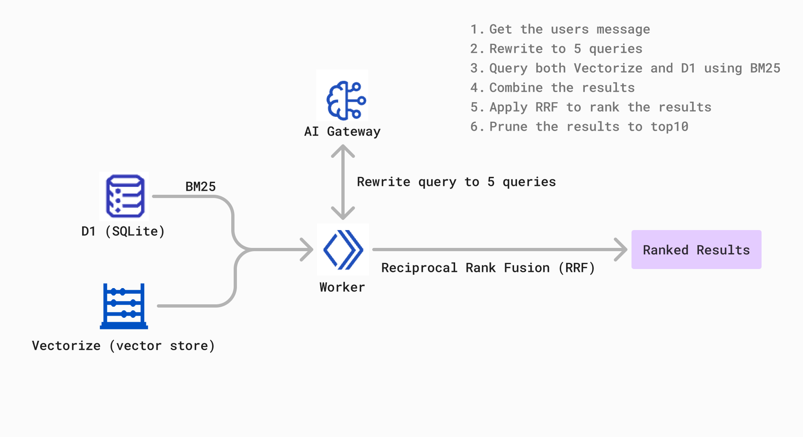

# Chat with PDF 🗣️💬📄

Chat with PDF is a full-stack AI-powered application that lets you to ask questions to PDF documents.

The application is running with server-side rendering on the edge using Cloudflare Pages.

This repository has been adapted to run fully locally without NuxtHub/Cloudflare. Deployment instructions have been removed — the project is local-first.

### 🚀 Key Features

- **Hybrid RAG**: Hybrid RAG using Full-Text Search on D1 and Vector Search on Vectorize
- **Streamed Responses**: Information is streamed real-time to the UI using Server-Sent Events
- **High-Performance**: Deployed on the edge with server-side rendering using Cloudflare Pages

<!-- ### 🎥 See It in Action

https://github.com/Atinux/atidraw/assets/904724/85f79def-f633-40b7-97c2-3a8579e65af1

Ready to create? Visit [chat-with-pdf.nuxt.dev](https://chat-with-pdf.nuxt.dev) and share your best drawing! -->

## 🛠 Tech Stack

- [Nuxt](https://nuxt.com) - The Intuitive Vue Framework
- [Nuxt UI](https://github.com/nuxt/ui) - Beautiful UI library with TailwindCSS
- [Drizzle ORM](https://orm.drizzle.team/) - Powerful modern TypeScript ORM
- [unpdf](https://github.com/unjs/unpdf) - Platform-agnostic version of [PDF.js](https://github.com/mozilla/pdf.js) for serverless environments
- [NuxtHub Rate Limit](https://github.com/fayazara/nuxthub-ratelimit) - Ratelimiting requests
- [NuxtHub](https://hub.nuxt.com) - Build & deploy to your Cloudflare account with zero configuration
  - [`hubBlob()`](https://hub.nuxt.com/docs/features/blob) to store PDFs in Cloudflare R2
  - [`hubDatabase()`](https://hub.nuxt.com/docs/features/blob) to store document chunks and full-text search on Cloudflare D1
  - [`hubAI()`](https://hub.nuxt.com/docs/features/ai) to run Cloudflare AI models for LLM chat and generating text embeddings
  - [`hubVectorize()`](https://hub.nuxt.com/docs/features/ai) to find relevant document context in Cloudflare Vectorize
  - [`hubKV()`](https://hub.nuxt.com/docs/features/ai) for IP ratelimiting
- [`npx nuxthub deploy`](https://github.com/nuxt-hub/cli) - To deploy the app on your Cloudflare account for free

## 🏎️ How does it work?



This project uses a combination of classical Full Text Search (sparse) against Cloudflare D1 and Hybrid Search with embeddings against Vectorize (dense) to provide the best of both worlds providing the most applicable context to the LLM.

The way it works is this:

1. We take user input and we rewrite it to 5 different queries using an LLM
2. We run each of these queries against our both datastores - D1 database using BM25 for full-text search and Vectorize for dense retrieval
3. We take the results from both datastores and we merge them together using [Reciprocal Rank Fusion](https://www.elastic.co/guide/en/elasticsearch/reference/current/rrf.html) which provides us with a single list of results
4. We then take the top 10 results from this list and we pass them to the LLM to generate a response

<sub>Credits: https://github.com/RafalWilinski/cloudflare-rag#hybrid-search-rag</sub>

## 🚀 Quick Start

1. Install dependencies with npm
    ```bash
    npm install
    ```
2. Create & link a NuxtHub project to enable running AI models on your Cloudflare account
    ```bash
    npx nuxthub link
    ```
4. Launch the dev server
    ```bash
    npm run dev
    ```

Visit `http://localhost:3000` and start chatting with documents!
Local development
-----------------

This repository is configured to run fully locally. To get started:

```bash
cp .env.example .env
# edit .env to set OPENAI_API_KEY if you want OpenAI for local AI
npm install
npm run dev
```

The app uses a local SQLite DB at `./data/dev.sqlite` and stores uploaded PDFs under `./local-storage`.

## 🌐 Deployment

This fork is focused on local development. If you want to deploy to a cloud provider you'll need to wire up external services for blob storage, embeddings/LLM, vector store and a relational DB. If you'd like, I can add a Cloud Run / Docker deployment guide that uses Google services (Cloud Storage, Vertex AI, Cloud SQL) — say the word and I'll scaffold it.

### Remote Storage

Once your project is deployed, you can use [NuxtHub Remote Storage](https://hub.nuxt.com/docs/getting-started/remote-storage) to connect to your preview or production Cloudflare R2 bucket in development using the `--remote` flag:

```bash
pnpm dev --remote
```

## 🔗 Useful Links

- [Live Demo](https://chat-with-pdf.nuxt.dev)
- [NuxtHub Documentation](https://hub.nuxt.com)
- [Nuxt UI](https://ui.nuxt.com)
- [Nuxt](https://nuxt.com)

## 📝 License

Published under the [MIT license](./LICENSE).

## 🙋 Credits

- [cloudflare-rag](https://github.com/RafalWilinski/cloudflare-rag) by [Rafal Wilinski](https://github.com/RafalWilinski) - Chat with PDF is a port of the cloudflare-rag project to NuxtHub and Nuxt UI. The core logic and functionality are derived from cloudflare-rag, adapted to work with NuxtHub.
- [hub-chat](https://github.com/ra-jeev/hub-chat) by [Rajeev R Sharma](https://github.com/ra-jeev) - Parts of UI and inspiration for the streaming composable.
